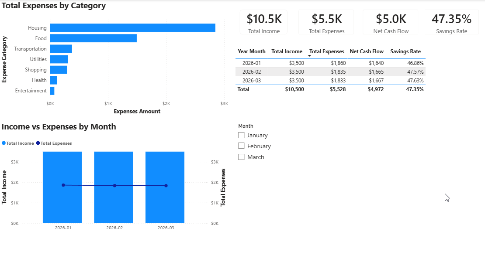
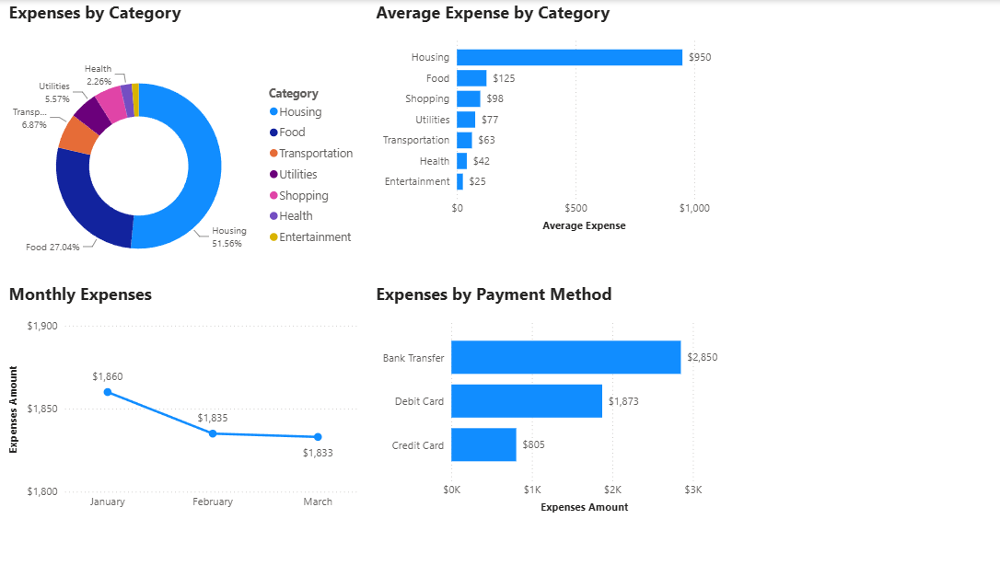

# Personal Finance Analytics Dashboard

## Executive Summary
Personal Finance Analytics Dashboard is a Power BI project designed to transform transaction-level financial data into an interactive analytical solution for monitoring personal financial performance and spending behavior.

The project uses a synthetic dataset of 37 financial transactions covering a three-month period in 2026. Data was prepared using Power Query, modeled using a dedicated date dimension, and analyzed through DAX measures.

The final two-page dashboard provides an overview of income, expenses, net cash flow, and savings rate, while enabling detailed analysis of spending categories, monthly trends, and payment methods.

## Project Files

- **Power BI Dashboard** — [Power BI project files](Power-BI/)
- **Source Dataset** — [Excel source data](data/)
- **Dashboard Screenshots** — [Dashboard previews](screenshots/)
- **Project Documentation** — [Technical documentation](documentation/)

## Business Problem
The objective was to transform transaction-level financial data into an interactive Business Intelligence solution that makes financial performance and spending behavior easier to understand.

## Objectives & KPIs
- Monitor Total Income, Total Expenses, Net Cash Flow, and Savings Rate.
- Analyze spending distribution and average expense by category.
- Analyze monthly financial behavior.
- Analyze spending by payment method.
- Enable interactive filtering and cross-filtering.

| KPI | Definition |
|---|---|
| Total Income | Total value of transactions classified as Income |
| Total Expenses | Total value of transactions classified as Expense |
| Net Cash Flow | Total Income - Total Expenses |
| Savings Rate | Net Cash Flow / Total Income |

## Dataset & Data Preparation
Synthetic personal finance transaction dataset created specifically for the project. It contains 37 transaction records and 8 analytical fields: Date, Description, Category, Type, Amount, Payment Method, Month, and Notes.

Power Query preparation included source navigation, data-type changes, a custom column, removal of unnecessary columns, column reordering, additional type adjustments, and renaming `Correct Date` to `Date`.

## Project Scope & Limitations

This project uses a synthetic dataset containing 37 financial transactions across a three-month period in 2026. The dataset was intentionally designed to demonstrate an end-to-end Power BI analytics workflow, including data preparation, dimensional modeling, DAX development, dashboard design, validation, and business insight generation.

The project focuses on analytical workflow, data modeling, and dashboard development rather than large-scale data engineering, predictive modeling, or production-level financial reporting.

## Data Model
The solution uses a dimensional model with `tblTransactions` and a dedicated `DimDate` table.

Relationship: `DimDate[Date] (1) -> tblTransactions[Date] (*)`

DimDate contains Date, Month Name, Month Number, Year, and Year Month. Month Name is sorted by Month Number.

## DAX & Analytical Layer
Eight measures were created:
- Total Income
- Total Expenses
- Net Cash Flow
- Savings Rate
- Average Income
- Average Expense
- Income Transactions
- Expense Transactions

Key DAX logic:

```DAX
Total Expenses =
CALCULATE(
    SUM(tblTransactions[Amount]),
    tblTransactions[Type] = "Expense"
)

Net Cash Flow =
[Total Income] - [Total Expenses]

Savings Rate =
DIVIDE([Net Cash Flow], [Total Income], 0)
```

## Dashboard Design
### Financial Overview
High-level financial performance through KPI cards, expense distribution, monthly financial summary, income vs. expenses by month, and a Month slicer.

### Spending Analysis
Detailed spending analysis through expense distribution by category, average expense by category, monthly expenses, and payment-method analysis.

## Dashboard Preview

### Financial Overview



### Spending Analysis



## Validation & Quality Assurance
Power BI results were reconciled against the underlying Excel analysis. Key totals, monthly expenses, categories, payment methods, and derived indicators matched.

Functional testing covered single-month filtering, multi-month filtering, category selection, payment-method selection, cross-highlighting, combined filters, and reset behavior.

## Key Insights
1. Total Income: $10,500; Total Expenses: $5,528; Net Cash Flow: $4,972; Savings Rate: 47.35%.
2. Housing represented 51.56% of total expenses.
3. Housing and Food represented 78.60% of total expenses.
4. Expenses decreased from $1,860 in January to $1,833 in March: -$27 / -1.45%.
5. Monthly income remained constant at $3,500.
6. Savings rate improved by 0.77 percentage points from January to March.

## Business Recommendations
- Monitor Housing as the primary cost driver.
- Closely monitor Food spending for optimization opportunities.
- Maintain the current savings discipline.
- Use the current monthly spending level as a baseline.
- Preserve income stability while optimizing the largest expense categories.

## Tools & Technologies
- Microsoft Excel — source dataset and preliminary analysis.
- Power Query — data preparation and transformation.
- Microsoft Power BI — modeling, DAX, visualization, and dashboard development.
- DAX — analytical measures.
- GitHub / Markdown — portfolio documentation.

## Project Outcome
The project demonstrates an end-to-end BI workflow:

**Excel -> Power Query -> Dimensional Model -> DAX -> Interactive Dashboard -> Validation -> Insights -> Recommendations**
